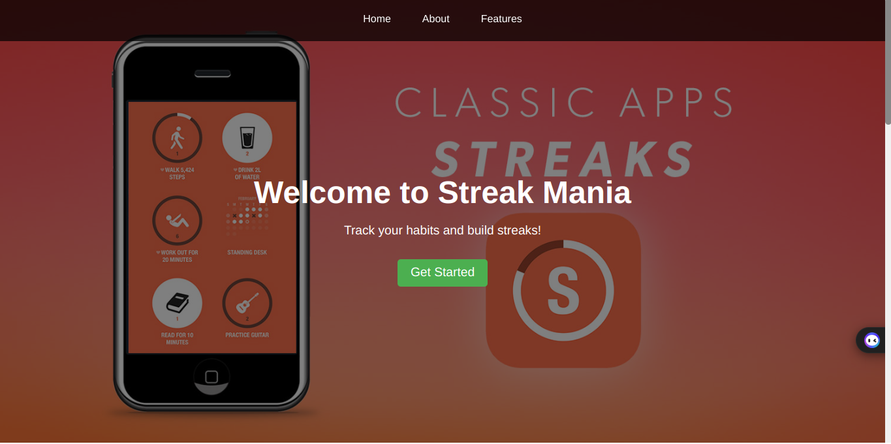
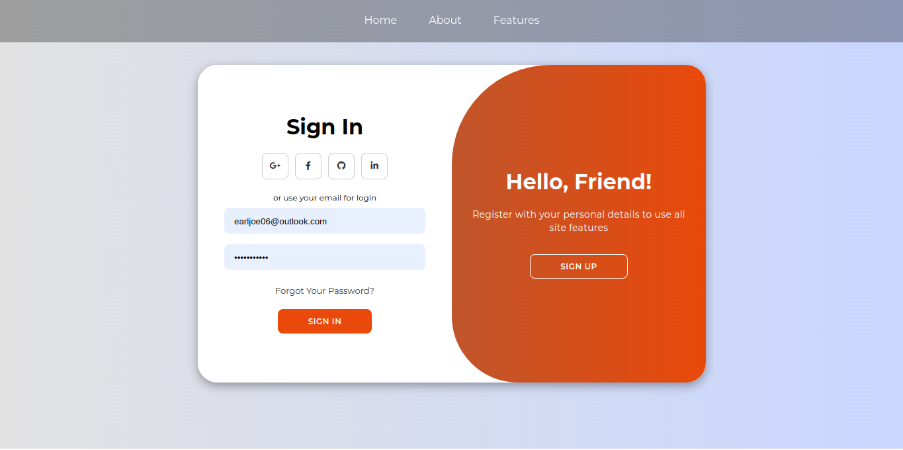
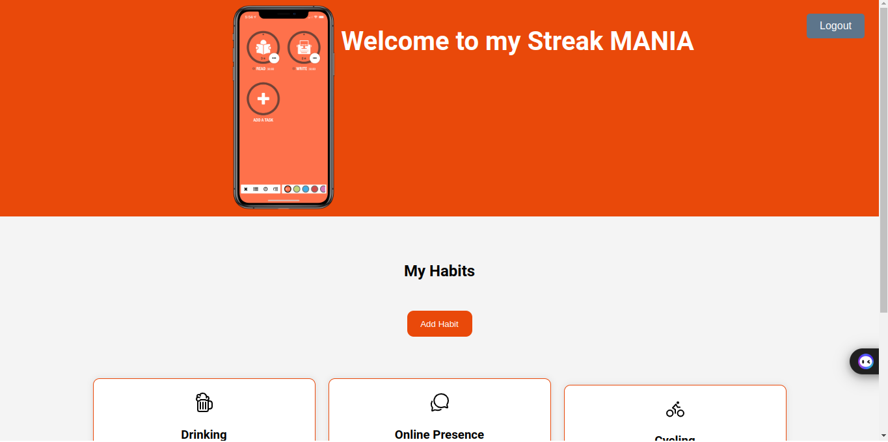

# Streak Mania

Welcome to the Streak Mania! This application helps users maintain and track their daily streaks. It includes a landing page, a login page, and a user dashboard.

## Table of Contents

- [Overview](#overview)
- [Pages](#Pages)
- [Getting Started](#getting-started)
- [Usage](#usage)
- [Screenshots](#screenshots)
- [Contributing](#contributing)
- [License](#license)

## Overview

The Streak Application is designed to help users build and maintain daily habits by tracking their progress. Users can log in and view their dashboard to see their current streaks and manage their activities.

## Pages

- **Landing Page**: A welcoming page that introduces users to the application.
- **Login**: Secure login functionality for users to access their accounts.
- **User Dashboard**: A personalized dashboard where users can view and manage their streaks.

## Getting Started

To get a local copy of the project up and running, follow these steps:

1. **Clone the repository:**
    ```bash
    git clone https://github.com/Earl006/streak-app.git
    ```

2. **Start the backend server:**
    ```bash
    cd backend
    npm run dev
    ```

3. **Start the frontend development server:**
    ```bash
    cd frontend
    tsc -w
    ```

4. **Go live using VS Code Live Server extension:**
    - Open the `frontend` folder in VS Code.
    - Right-click on the `index.html` file.
    - Select "Open with Live Server".

## Usage

Once the application is running, you can navigate to the landing page, log in, and access your user dashboard to start tracking your streaks.

## Screenshots

### Landing Page


### Login Page


### User Dashboard


## Contributing

Contributions are welcome! Please fork the repository and create a pull request with your changes.

1. Fork the Project
2. Create your Feature Branch (`git checkout -b feature/AmazingFeature`)
3. Commit your Changes (`git commit -m 'Add some AmazingFeature'`)
4. Push to the Branch (`git push origin feature/AmazingFeature`)
5. Open a Pull Request

## License

Distributed under the MIT License. See `LICENSE` for more information.
